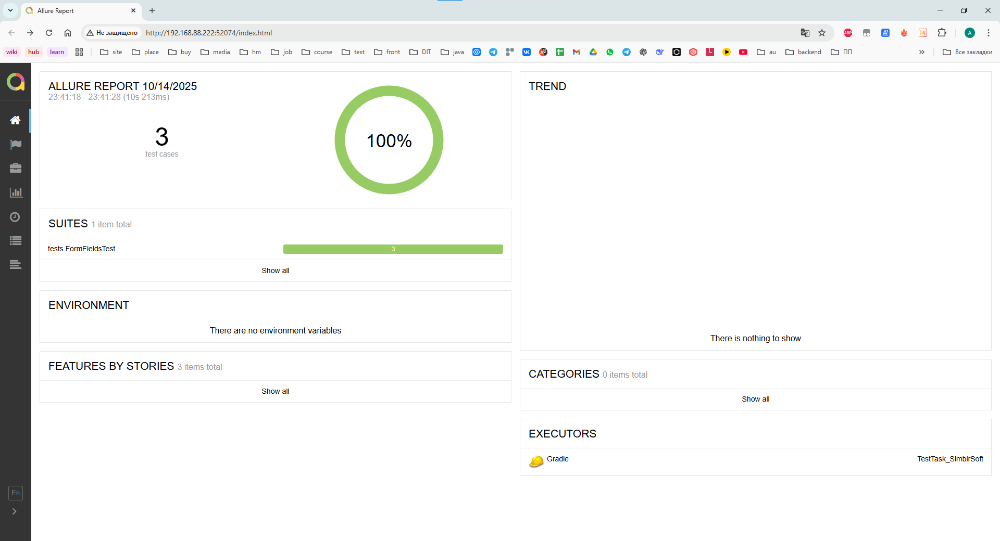

# Тестовое задание Панферовой Анастасии

## 📋 Описание проекта
Проект автоматизированных UI-тестов для формы на сайте practice-automation.com

## 📊 Allure отчет


## 🧪 Тест-кейсы

### Позитивный тест-кейс
| ID | Название | Тип | Шаги | Ожидаемый результат |
|----|----------|-----|------|---------------------|
| TC-001 | Проверка отправки формы с заполнением только обязательного поля | Позитивный | 1. Открыть страницу Form Fields<br>2. Заполнить поле "Name" значением "Jane Ostin"<br>3. Нажать кнопку "Submit" | **Появился алерт с текстом `Message received!`** |

### Негативный тест-кейс
| ID | Название | Тип | Шаги | Ожидаемый результат |
|----|----------|-----|------|---------------------|
| TC-002 | Проверка отправки формы с пустыми полями | Негативный | 1. Открыть страницу Form Fields<br>2. Нажать кнопку "Submit" | **Страница скроллится к полю "Name", курсор активирован в поле** |

## 🛠 Технологии
- **Java 17**
- **Selenium WebDriver**
- **JUnit 5**
- **Gradle**
- **Allure Reporting**
- **Data Faker**

## 🚀 Запуск тестов

### Локальный запуск
```bash
# Запуск всех тестов
./gradlew test

# Генерация Allure отчета
./gradlew allureServe
```

## 📝 Паттерны
- Page Object Model
- Page Factory
- Fluent Interface


