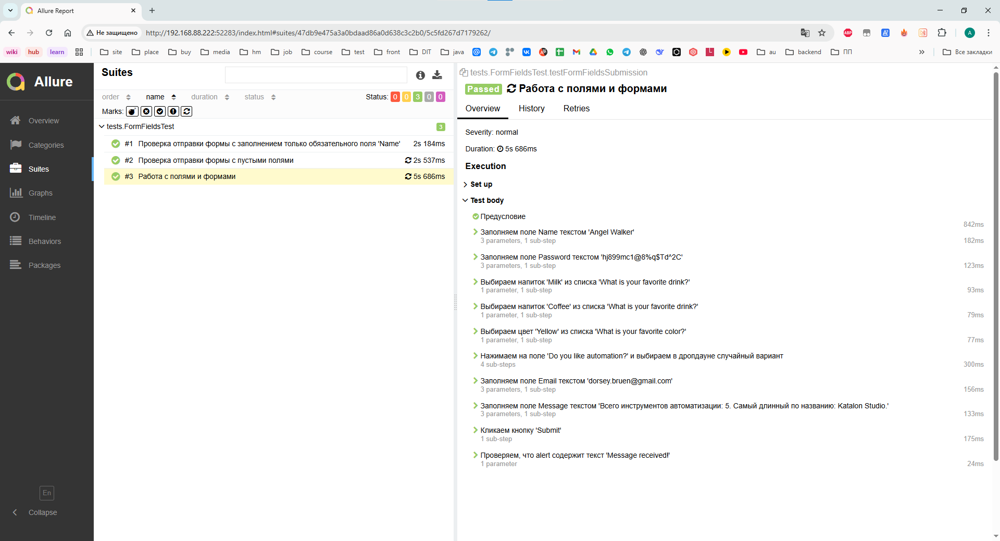
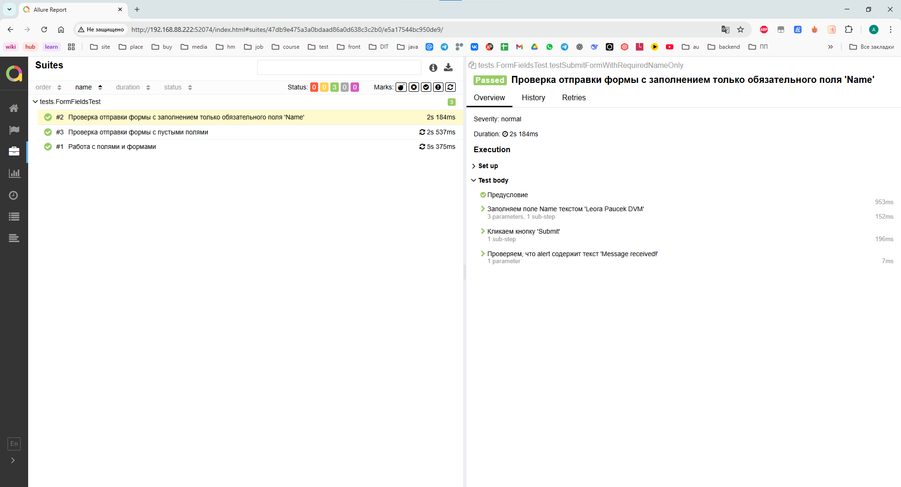
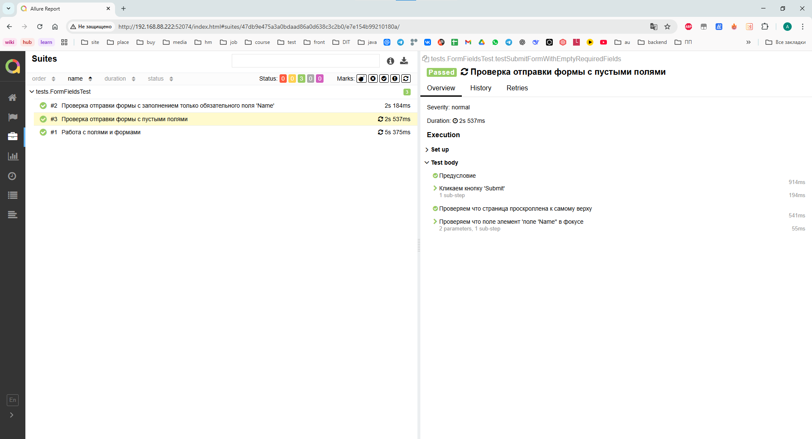

# Тестовое задание Панферовой Анастасии

## 📋 Описание проекта
Проект автоматизированных UI-тестов для формы на сайте practice-automation.com

## 📊 Allure отчет

<details>
<summary>📸 Посмотреть общий Allure отчет</summary>


</details>

<details>
<summary>📋 ТС-001: Работа с полями и формами</summary>


</details>

<details>
<summary>📋 ТС-002: Проверка отправки формы с заполнением только обязательного поля 'Name'</summary>


</details>

<details>
<summary>📋 ТС-003: Проверка отправки формы с пустыми полями</summary>


</details>

## 🧪 Тест-кейсы

### ТС-001: Работа с полями и формами
**Тип:** Позитивный  
**Предусловие:**
1. Открыть браузер
2. Перейти по ссылке https://practice-automation.com/form-fields/

| Шаги | Ожидаемый результат |
|------|---------------------|
| 1. Заполнить поле Name<br>2. Заполнить поле Password<br>3. Из списка What is your favorite drink? выбрать Milk и Coffee<br>4. Из списка What is your favorite color? выбрать Yellow<br>5. В поле Do you like automation? выбрать любой вариант<br>6. Поле Email заполнить строкой формата name@example.com<br>7. В поле Message написать количество инструментов, описанных в пункте Automation tools, и написать инструмент из списка Automation tools, содержащий наибольшее количество символов<br>8. Нажать на кнопку Submit | **Появился алерт с текстом `Message received!`** |

### ТС-002: Проверка отправки формы с заполнением только обязательного поля 'Name'
**Тип:** Позитивный  
**Предусловие:**
1. Открыть браузер
2. Перейти по ссылке https://practice-automation.com/form-fields/

| Шаги | Ожидаемый результат |
|------|---------------------|
| 1. Заполнить поле с заголовком "Name" валидным значением например "Jane Ostin"<br>2. Нажать кнопку "Submit" | **Появился алерт с текстом `Message received!`** |

### ТС-003: Проверка отправки формы с пустыми полями
**Тип:** Негативный  
**Предусловие:**
1. Открыть браузер
2. Перейти по ссылке https://practice-automation.com/form-fields/

| Шаги | Ожидаемый результат                                                                      |
|------|------------------------------------------------------------------------------------------|
| 1. Нажать кнопку "Submit" | **- Страница проскроллена к верхней части экрана<br>- Курсор активирован в поле "Name"** |
## 🛠 Технологии
- **Java 17**
- **Selenium WebDriver**
- **JUnit 5**
- **Gradle**
- **Allure Reporting**
- **Data Faker**

## 🚀 Запуск тестов

### Локальный запуск
```bash
# Запуск всех тестов
./gradlew test

# Генерация Allure отчета
./gradlew allureServe
```

## 📝 Паттерны
- Page Object Model
- Page Factory
- Fluent Interface


